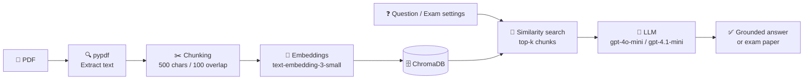

<div align="center">


<a href="https://git.io/typing-svg">
  
</a>

<br/>


</div>

---

## 🧊 𝗪𝗵𝗮𝘁 𝗶𝘀 𝘁𝗵𝗶𝘀?

**DocMind RAG** is a small suite of apps built on a **Naive RAG (Retrieval-Augmented Generation)** pipeline. Instead of letting an LLM guess, every answer is grounded in the text of *your* PDF.

| # | App | What it does | Interface |
|---|-----|--------------|-----------|
| 1️⃣ | **PDF Q&A (CLI)** | Ask questions about any PDF (research paper, CV, notes) from the terminal | Terminal |
| 2️⃣ | **Document Intelligence** | Upload a PDF, ask questions, inspect the retrieved chunks | Streamlit |
| 3️⃣ | **AI Question Paper Generator** | Upload a syllabus or notes and get a formal exam paper with a PDF download | Streamlit (dark UI) |

---

## ⚡ 𝗛𝗼𝘄 𝗶𝘁 𝘄𝗼𝗿𝗸𝘀



> **In plain words:** the PDF is cut into small pieces, each piece is turned into numbers (embeddings), and when you ask something, the most similar pieces are fetched and handed to the LLM as its only source of truth.

---

## ✨ 𝗙𝗲𝗮𝘁𝘂𝗿𝗲𝘀

- 📚 **Grounded answers**: the LLM is told to use *only* the retrieved context, and to say so when the answer isn't in the PDF
- 🔎 **Context inspector**: expand to see exactly which chunks were used
- 🧾 **Exam paper generation**: choose duration, total marks, difficulty and number of questions
- 📄 **One-click PDF export** of the generated paper (ReportLab)
- 🌑 **Custom dark UI** with Inter and Plus Jakarta Sans fonts
- ⚙️ **Session caching** so the PDF is embedded only once per upload

---

## 🗂️ 𝗣𝗿𝗼𝗷𝗲𝗰𝘁 𝗦𝘁𝗿𝘂𝗰𝘁𝘂𝗿𝗲

```text
docmind-rag/
├── 📁 cli/
│   └── pdf_qa_cli.py              # Terminal PDF Q&A (naive RAG)
├── 📁 apps/
│   ├── document_intelligence.py   # Streamlit PDF Q&A app
│   └── question_paper_generator.py# Streamlit exam paper generator
├── 📄 requirements.txt
├── 📄 .env.example
└── 📄 README.md
```

---

## 🚀 𝗤𝘂𝗶𝗰𝗸 𝗦𝘁𝗮𝗿𝘁

**1. Clone**

```bash
git clone https://github.com/<your-username>/docmind-rag.git
cd docmind-rag
```

**2. Create a virtual environment**

```bash
python -m venv venv
# Windows
venv\Scripts\activate
# macOS / Linux
source venv/bin/activate
```

**3. Install dependencies**

```bash
pip install -r requirements.txt
```

<details>
<summary><b>📦 requirements.txt</b></summary>

```text
streamlit
python-dotenv
pypdf
langchain-text-splitters
langchain-openai
langchain-chroma
chromadb
reportlab
```

</details>

**4. Add your API key**

Create a `.env` file in the project root:

```env
OPENAI_API_KEY=your_openai_api_key_here
```

**5. Run an app**

```bash
# Terminal chatbot
python cli/pdf_qa_cli.py

# Streamlit PDF assistant
streamlit run apps/document_intelligence.py

# Exam paper generator
streamlit run apps/question_paper_generator.py
```

---

## 🎛️ 𝗖𝗼𝗻𝗳𝗶𝗴𝘂𝗿𝗮𝘁𝗶𝗼𝗻

| Setting | Value | Where |
|---------|-------|-------|
| Embedding model | `text-embedding-3-small` | all apps |
| LLM | `gpt-4o-mini` / `gpt-4.1-mini` | all apps |
| Chunk size / overlap | `500` / `100` characters | all apps |
| Retrieval `k` | `5` (Q&A), `10` (paper generator) | similarity search |
| Temperature | `0` (Q&A), `0.3` (paper generator) | LLM call |

---

## 📝 𝗤𝘂𝗲𝘀𝘁𝗶𝗼𝗻 𝗣𝗮𝗽𝗲𝗿 𝗚𝗲𝗻𝗲𝗿𝗮𝘁𝗼𝗿: 𝗨𝘀𝗮𝗴𝗲

1. Upload a **syllabus or lecture notes PDF**
2. Set **Duration, Total Marks, Difficulty, Number of Questions**
3. Click **Generate Question Paper**
4. Review the paper, inspect the source chunks, and **download it as a PDF**

---

## 🧠 𝗪𝗵𝘆 "𝗡𝗮𝗶𝘃𝗲" 𝗥𝗔𝗚?

This project is deliberately the simplest useful RAG loop, a clean baseline to build on.

| Naive RAG (this repo) | Possible upgrades |
|-----------------------|-------------------|
| Fixed-size character chunks | Semantic / section-aware chunking |
| Plain vector similarity | Hybrid search (BM25 + vectors), re-ranking |
| One retrieval pass | Query rewriting, multi-hop retrieval |
| No memory | Chat history, LangGraph agents |
| Text-only PDFs | OCR for scanned documents |

---

## 🛣️ 𝗥𝗼𝗮𝗱𝗺𝗮𝗽

- [x] CLI PDF Q&A
- [x] Streamlit PDF assistant with context viewer
- [x] Exam paper generator with PDF export
- [ ] Multi-PDF support
- [ ] Chat history
- [ ] Section-wise / unit-wise question distribution
- [ ] Answer key generation
- [ ] Local LLM option (Ollama)

---

## 🤝 𝗖𝗼𝗻𝘁𝗿𝗶𝗯𝘂𝘁𝗶𝗻𝗴

Pull requests are welcome. For major changes, please open an issue first to discuss what you'd like to change.

---

<div align="center">

### 👩‍💻 𝗕𝘂𝗶𝗹𝘁 𝗯𝘆 **Anushka Dabhade**


⭐ *If this helped you, drop a star on the repo!* ⭐


</div>
